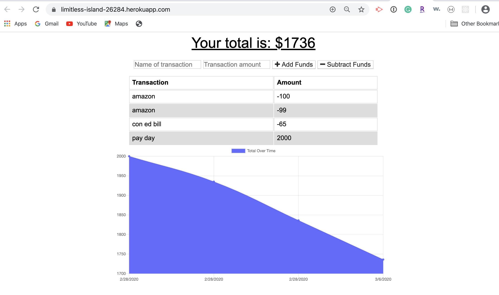

# BudgetTracker

## User Story

AS AN avid traveller
I WANT to be able to track my withdrawals and deposits with or without a data/internet connection
SO THAT my account balance is accurate when I am traveling

## Business Context

Giving users a fast and easy way to track their money is important, but allowing them to access that information anytime is even more important. Having offline functionality is paramount to our applications success.

## Acceptance Criteria

GIVEN a user is on Budget App without an internet connection
WHEN the user inputs a withdrawal or deposit
THEN that will be shown on the page, and added to their transaction history when their connection is back online.

## How to use the App

This app can be used on or offline and is designed as a Progressive Web Application so it can be used on your phone and saved to your homescreen for easy accessibility.

<ul>
<li>To run the code, after you clone the repo, run an npm install to install the following npm packages.
    <ul>
    <li>compression</li>
    <li>express</li>
    <li>lite-server</li>
    <li>mongoose</li>
    <li>morgan</li>
    </ul>
<li>To run the code, in the terminal run node server to start the app locally. The app will run on port 3000.</li>
</ul>

## Live app

The app is hosted on Heroku and can be viewed at: https://limitless-island-26284.herokuapp.com/

## Screenshots

